# DermaNova — AI-Powered Skin Cancer Detection Platform

DermaNova is a medical web platform developed as part of an AI course project 
for first-year engineering students in Advanced Technologies at ENSTAB. 
It leverages deep learning (VGG16) to assist dermatologists in the early 
detection of skin cancer lesions.

---

## Screenshots

### Landing Page
| Home | About |
|------|-------|
| 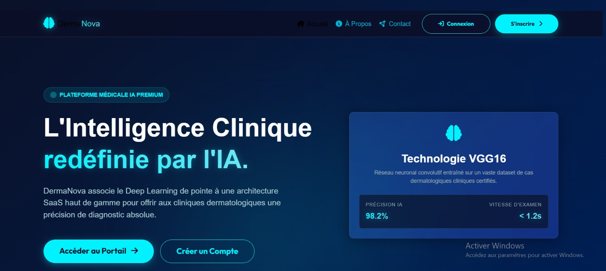 | 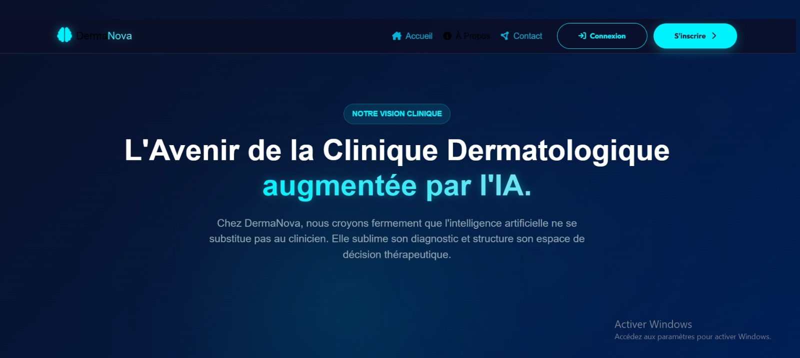 |

### Authentication
| Login | Register |
|-------|----------|
| 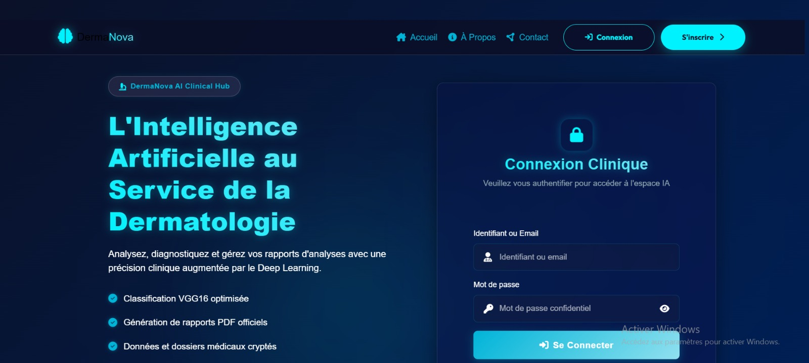 | 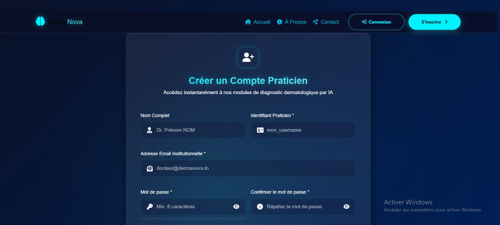 |

### Doctor Space
| Dashboard | Patients |
|-----------|----------|
| 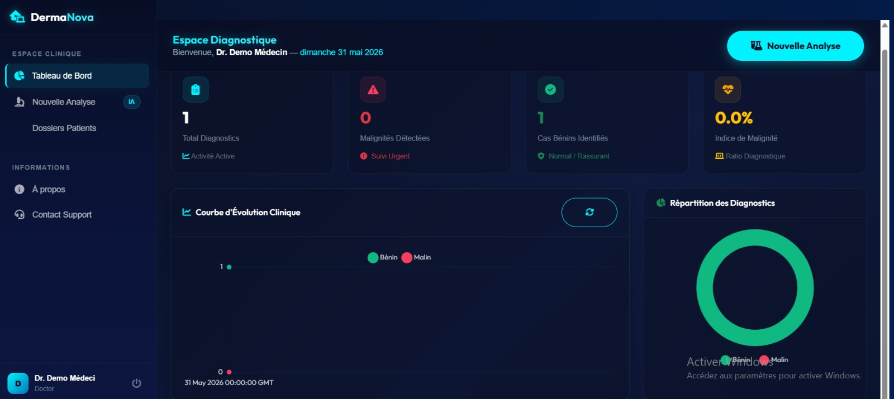 | 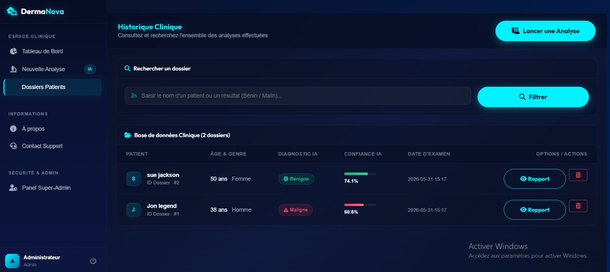 |

### AI Analysis
| Result Benign | Result Malign |
|---------------|---------------|
| 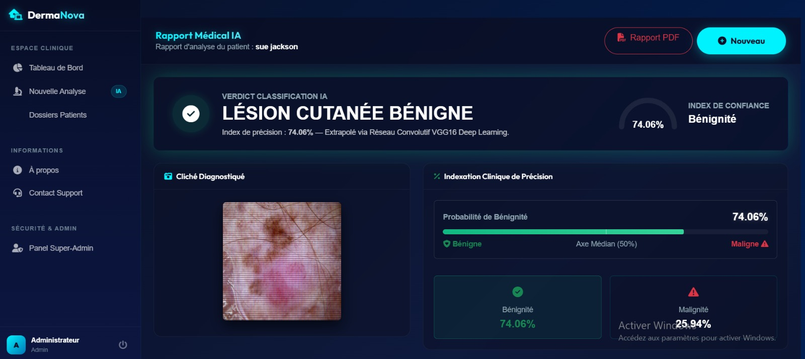 | 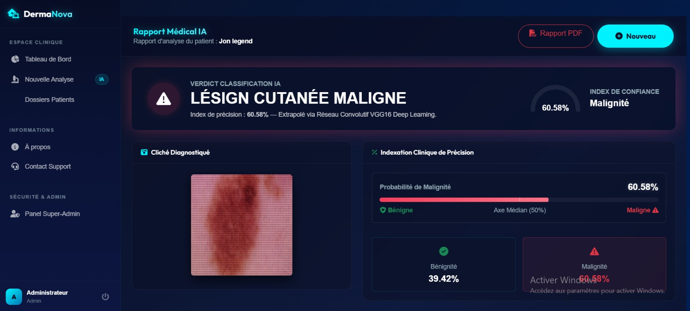 |

### Administration
| Dashboard Admin | Admin Panel |
|-----------------|-------------|
| 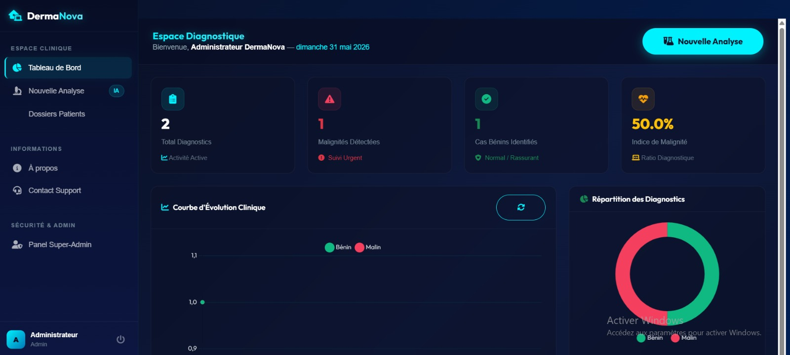 | 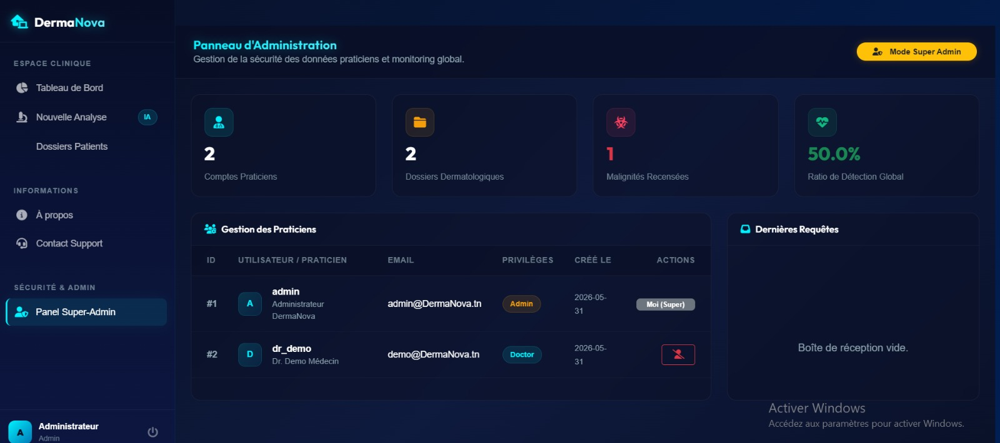 |

### Other
| Contact |
|---------|
| 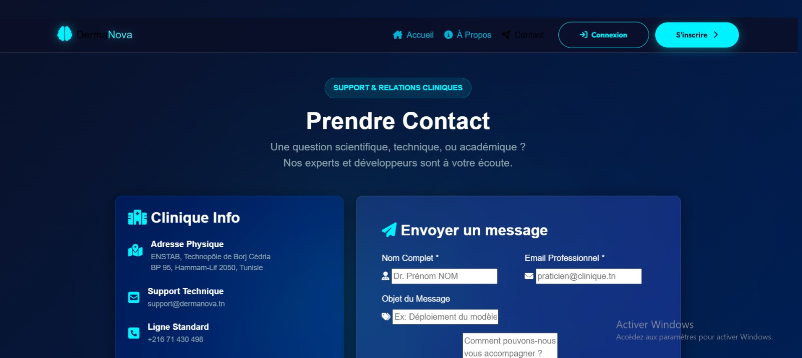 |

---

## Features

- AI-powered skin lesion classification using a VGG16 convolutional neural network
- Doctor dashboard with patient record management
- Secure authentication system with hashed passwords
- Automated PDF medical report generation
- Admin panel for platform monitoring and user management
- Dual database support: SQLite for development, MySQL for production

---

## Tech Stack

| Layer      | Technology                        |
|------------|-----------------------------------|
| Backend    | Python 3.x, Flask 2.3             |
| AI Model   | TensorFlow 2.13, Keras, VGG16     |
| Frontend   | HTML5, CSS3, JavaScript           |
| Database   | SQLite / MySQL                    |
| PDF Export | ReportLab                         |
| Server     | Gunicorn                          |

---

## Getting Started

```bash
